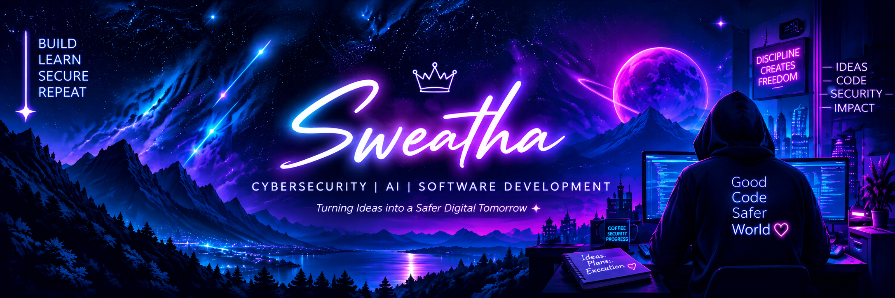

<!-- ==================== BANNER ==================== -->

  

 

<!-- ==================== CONNECT ==================== -->

# ✈️ Connect with me

Let's build, learn, and create something amazing together!

  
  &nbsp;
  
  &nbsp;
  

---

<!-- ==================== ABOUT ME ==================== -->

# 👩‍💻 About Me

🎓 Final Year Computer Science & Design Student

🔐 Passionate about Cybersecurity & Ethical Hacking

🤖 Exploring Artificial Intelligence and AI Agents

💻 Interested in Software Development & Web Development

🚀 Always learning and working on real-world projects

---

<!-- ==================== SKILLS ==================== -->

<h1 align="center">🛠️ Skills</h1>

<h3 align="center">💻 Development</h3>

  
  &nbsp;
  
  &nbsp;
  
  &nbsp;&nbsp;&nbsp;
  
  &nbsp;
  
  &nbsp;
  
  &nbsp;
  
  &nbsp;&nbsp;&nbsp;
  
  &nbsp;
  

<h3 align="center">🗄️ Data & Systems</h3>

  
  &nbsp;
  
  &nbsp;
  
  &nbsp;&nbsp;&nbsp;
  
  &nbsp;
  
  &nbsp;
  

<h3 align="center">🛠️ Tools & Platforms</h3>

  
  &nbsp;
  
  &nbsp;
  

---

<!-- ==================== FEATURED PROJECTS ==================== -->

# 🚀 Featured Projects

<table width="100%">

<tr>

<td width="50%" align="center" valign="top">

### 🛡️ CyberSphere AI

AI-powered cybersecurity platform designed to analyse security issues and support cybersecurity workflows.

**Cybersecurity • AI • Automation**

 

<a href="https://github.com/sweathamp/CyberSphere-AI">
  <b>View Project →</b>
</a>

</td>

<td width="50%" align="center" valign="top">

### 🤝 SkillXchange

A peer-to-peer platform where people can exchange skills and learn from each other.

**React • Node.js • PostgreSQL**

 

<a href="https://github.com/Subikshabala/SkillXchange">
  <b>View Project →</b>
</a>

</td>

</tr>

<tr>

<td width="50%" align="center" valign="top">

### 🧠 Adaptive Skill Path Recommendation System

An intelligent recommendation system that analyses user skills and learning goals to suggest personalized skill development paths.

**Python • AI/ML • Recommendation System**

 

<a href="https://github.com/sweathamp/Adaptive-Skill-Path-Recommendation-System">
  <b>View Project →</b>
</a>

</td>

<td width="50%" align="center" valign="top">

### 🎣 Phishing Detection System

An intelligent cybersecurity solution designed to identify and detect suspicious phishing attempts using security analysis and machine learning techniques.

**Python • Machine Learning • Cybersecurity**

 

<a href="https://github.com/sweathamp/PS02_PhishDetect">
  <b>View Project →</b>
</a>

</td>

</tr>

</table>

 

<a href="https://github.com/sweathamp?tab=repositories">
<b>🚀 View More Projects →</b>
</a>

---

<!-- ==================== QUOTE ==================== -->

  <i>"Keep learning. Keep building. Keep growing."</i>

  ❤️ Thanks for visiting!

